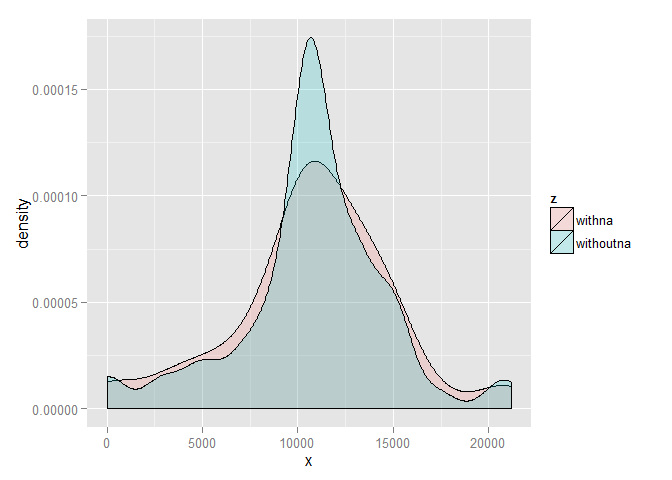

# Assignment 1 - Reproducible research
Friday, January 16, 2015  

### Loading and preprocessing the data   


```r
### Load relevant libraries

  library(data.table)
  library(sqldf)
```

```
## Loading required package: gsubfn
## Loading required package: proto
## Loading required package: RSQLite
## Loading required package: DBI
```

```r
  library(ggplot2)
  library(scales)
  library(date)

### Set working Directory

  setwd("C:/Users/rahul pandey/Dropbox/11 Analytics/02 Assignments/05 Reproducible research/repdata-data-activity")

### Read the file in a complete file called ac, and a backup file ac_orig
  ac <- read.csv("C:/Users/rahul pandey/Dropbox/11 Analytics/02 Assignments/05 Reproducible research/repdata-data-activity/activity.csv")
	ac_orig <- ac

### Transfer contents of variable to ca that has only non NA values
  ca <- na.omit(ac)
```

### mean total number of steps taken per day


```r
### Calculate sum for each day
  sumstepsdaily <- aggregate(ca$step,list(ca$date),sum)

###Create the histogram
### slightly  twisted logic for freqs, but it does not allow me to use daily code. The code uses excerpts from
### http://stackoverflow.com/questions/10770698/understanding-dates-and-plotting-a-histogram-with-ggplot2-in-r

	freqs <- aggregate(ca$date, by=list(ca$date), FUN=length)
	freqs$x <- sumstepsdaily$x
	freqs$names <- as.Date(freqs$Group.1, format="%Y-%m-%d")
	hist1plot <- ggplot(freqs, aes(x=names, y=x)) + geom_bar(stat="identity",fill = "blue")
	hist1plot <- hist1plot +  ylab("Frequency") + xlab("Date") +  theme_bw()
	hist1plot
```

 

### Average daily pattern


```r
###Mean and median


  agg_mean <- mean(ca$steps, na.rm=TRUE)
	agg_median <- median(ca$steps, na.rm=TRUE)
	##agg_mean
	##agg_median
	mean<- aggregate(ca$step,list(ca$date),FUN=mean,na.action=na.pass, na.rm=TRUE)
	colnames(mean) <- c("date","mean")
	head(mean)
```

```
##         date     mean
## 1 2012-10-02  0.43750
## 2 2012-10-03 39.41667
## 3 2012-10-04 42.06944
## 4 2012-10-05 46.15972
## 5 2012-10-06 53.54167
## 6 2012-10-07 38.24653
```

```r
	median<- aggregate(ca$step,list(ca$date),median)
	colnames(median) <- c("date","median")
	head(median)
```

```
##         date median
## 1 2012-10-02      0
## 2 2012-10-03      0
## 3 2012-10-04      0
## 4 2012-10-05      0
## 5 2012-10-06      0
## 6 2012-10-07      0
```
 The values above highlight the mean and median values over differnt days
 
### Time Series Plot

```r
###Draw time series plot. First pull values to t, and then plot t

  t<- aggregate(ca$step,list(ca$interval),FUN=mean)
  labels <- c("00:00", "05:00", "10:00", "15:00", "20:00")
	labels.at <- seq(0, 2000, 500)

	plot(t$Group.1, t$x, xlab = "5-minute interval", ylab = "average number of steps taken", type = "l")
	title("timeseries plot")
	axis(side = 1, at = labels.at, labels = labels)
```

 
As shown in plot above, The duration between 08:35 AM and 08:40 AM witnesses maximum number of steps

### Part 2 - input missing values

```r
###PART 2

### Calculate number of blank rows
  new_ac <- subset(ac, is.na(ac$steps))
	NROW(new_ac)
```

```
## [1] 2304
```

The above value lists the number of missing rows in original dataset

### New histogram with no missing values

```r
### Calculate mean and then use it to replace all NAs
	meanvac <- mean(ac$steps,na.rm=TRUE)
	ac$steps[is.na(ac$steps)] <- meanvac

###Create the histogram with the new set of values
	sumstepsdaily1 <- aggregate(ac$step,list(ac$date),sum)
	freqs1 <- aggregate(ca$date, by=list(ca$date), FUN=length)
### Calculate number of blank rows
  new_ac <- subset(ac, is.na(ac$steps))
	NROW(new_ac)
```

```
## [1] 0
```

```r
### Calculate mean and then use it to replace all NAs
	meanvac <- mean(ac$steps,na.rm=TRUE)
	ac$steps[is.na(ac$steps)] <- meanvac

###Create the histogram with the new set of values
	sumstepsdaily1 <- aggregate(ac$step,list(ac$date),sum)
	freqs1 <- aggregate(ac$date, by=list(ac$date), FUN=length)
	freqs1$x <- sumstepsdaily1$x
	freqs1$names <- as.Date(freqs1$Group.1, format="%Y-%m-%d")
	hist2plot <- ggplot(freqs1, aes(x=names, y=x)) + geom_bar(stat="identity",fill = "green")
	hist2plot <- hist2plot +  ylab("Frequency") + xlab("Date") +  theme_bw()
	hist2plot
```

 

 If we compare this with the earlier histogram, we see that the blank values have now been replaced with mean, leading to higher sums
 
 The following plot illustrates the difference more clearly
 

```r
  sumstepsdaily$z <- 'withna'
	sumstepsdaily1$z <- 'withoutna'
	comb <- rbind(sumstepsdaily, sumstepsdaily1)

	ggplot(comb, aes(x, fill = z)) + geom_density(alpha = 0.2)
```

 

### The new mean and median values


```r
###Mean and median

  acmean<- aggregate(ac$step,list(ac$date),FUN=mean,na.action=na.pass, na.rm=TRUE)
	head(acmean)
```

```
##      Group.1        x
## 1 2012-10-01 37.38260
## 2 2012-10-02  0.43750
## 3 2012-10-03 39.41667
## 4 2012-10-04 42.06944
## 5 2012-10-05 46.15972
## 6 2012-10-06 53.54167
```

```r
	acmedian<- aggregate(ac$step,list(ac$date),median)
	head(acmedian)
```

```
##      Group.1       x
## 1 2012-10-01 37.3826
## 2 2012-10-02  0.0000
## 3 2012-10-03  0.0000
## 4 2012-10-04  0.0000
## 5 2012-10-05  0.0000
## 6 2012-10-06  0.0000
```

Comparing with earlier values we see different medians

### Comparing weekdays and weekends


```r
### Get day type and change to weekday, or weekend; 
  ac$daytype <- weekdays(as.Date(ac$date))
	ac$daytype[ac$daytype == "Monday"]<-"Weekday"
	ac$daytype[ac$daytype == "Tuesday"]<-"Weekday"
	ac$daytype[ac$daytype == "Wednesday"]<-"Weekday"
	ac$daytype[ac$daytype == "Thursday"]<-"Weekday"
	ac$daytype[ac$daytype == "Friday"]<-"Weekday"
	ac$daytype[ac$daytype == "Saturday"]<-"Weekend"
	ac$daytype[ac$daytype == "Sunday"]<-"Weekend"

### Split ac into ac_weekday and ac_weekend 
	ac_weekeday <- subset(ac, ac$daytype == "Weekday")
	ac_weekend <- subset(ac, ac$daytype == "Weekend")

### Plot variable calculations
	t_we<- aggregate(ac_weekend$step,list(ac_weekend$interval),FUN=mean)
	t_wd<- aggregate(ac_weekeday$step,list(ac_weekeday$interval),FUN=mean)

### Set parameters. Some code referenced from ##http://stackoverflow.com/questions/12415206/par-options-pin-and-oma-in-r
	par(mfrow=c(2,1),mar=c(2,4,2,2),oma=c(0,0,2,0),cex.axis=0.9)

### Weekday variable Plot

	plot(t_we$Group.1, t_we$x, xlab = "", ylab = "number of steps", type = "l",col="Blue")
	title("Weekend plot")
	axis(side = 1, at = labels.at, labels = labels)
	plot(t_wd$Group.1, t_wd$x, xlab = "Interval", ylab = "number of steps", type = "l",col="Red")
	title("Weekday plot")
	axis(side = 1, at = labels.at, labels = labels)
```

 

We can clearly see weekday activites having single max at around 8:35 AM, while weekend activities have multiple maximum values
